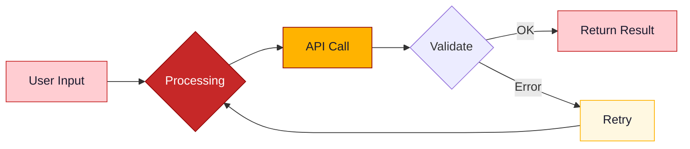

# Enhanced PowerPoint Generator Skill

Generate professional PowerPoint presentations with a white-background editorial style featuring red title typography, warm gold highlights, slate-blue supporting tones, and clean neutral layouts. Supports SVG diagram generation, Mermaid diagram rendering, animated GIF creation via Manim, and multi-format image embedding (PNG, JPG, GIF).

## Overview

HTML-to-PPTX workflow with an **Editorial Light** theme. Styling, colors, fonts, and layouts are fully configurable via JSON.

**Capabilities:**
- **14 Slide Layout Templates**: Title, comparison, timeline, funnel, hub, quadrant, process flow, problem/solution, pipeline, and more
- **SVG Diagram Generation**: Programmatic flowcharts, architecture diagrams, and technical illustrations rasterized to PNG
- **Mermaid Diagram Rendering**: Flowcharts, sequence diagrams, ER diagrams, state machines, Gantt charts via `render-mermaid.js`
- **Animated GIF Generation**: Manim Community Edition for process animations and step-by-step visuals
- **Multi-format Images**: PNG, JPG, GIF embedding with Sharp-based rasterization

## When to Use

- Create a PowerPoint with a modern, professional white-background aesthetic
- Generate slides from specific layout templates
- Build presentations with red title typography, white canvases, and harmonic supporting colors
- Include diagrams, illustrations, or animated visuals in slides

## Skill Contents

```
pptx-enhanced/
├── SKILL.md                      # This file
├── default-pptx-config.json      # Theme configuration (colors, fonts, layouts)
├── html2pptx.md                  # HTML slide creation rules and constraints
├── package.json                  # Node.js dependencies
├── requirements.txt              # Python dependencies
└── scripts/
    ├── html2pptx.js              # HTML to PowerPoint conversion
    ├── render-mermaid.js         # Mermaid diagram → PNG renderer (Playwright + CDN)
    ├── thumbnail.py              # Slide thumbnail grid generator
    └── inventory.py              # Text inventory extractor
```

## Setup

```bash
# Node.js dependencies
cd .claude/skills/pptx-enhanced && npm install && npm run install-browsers

# Python dependencies
pip install -r .claude/skills/pptx-enhanced/requirements.txt

# System requirements (macOS)
brew install libreoffice poppler
```

## Configuration

### Color Theme (Default: Editorial Light)

| Color Role | Hex | Usage |
|------------|-----|-------|
| primary | #C62828 | Slide title color and restrained high-emphasis accents |
| primaryDark | #8E0000 | Deep red emphasis for rare highlight moments |
| primaryLight | #FFF1F1 | Soft rose panels |
| secondary | #FFB300 | Gold callouts and key numeric highlights |
| secondaryLight | #FFF8E1 | Cream highlight surfaces |
| accent | #4E6E8E | Slate-blue supporting accent for charts and diagrams |
| background | #FFFFFF | Main slide background |
| backgroundAlt | #FAFAFC | Soft section panels |
| cardBackground | #FFFFFF | White card surfaces |
| text.dark | #1F2937 | Primary body and header text |
| text.medium | #5B6474 | Secondary body text |
| text.light | #7B8794 | Captions and annotations |
| text.onPrimary | #FFFFFF | Text on saturated red elements |
| text.highlight | #9A6700 | Emphasized gold text |

### Font Styles

| Style | Size | Weight | Usage |
|-------|------|--------|-------|
| title | 22-24pt | Bold | Slide titles in red |
| subtitle | 10-12pt | Normal | Subtitles, descriptors |
| sectionHeader | 14-16pt | Bold | Section headers in dark ink |
| contentHeader | 10-12pt | Bold | Card titles in dark ink or muted accent |
| body | 9-10pt | Normal | Body text (**minimum 9pt**) |
| caption | 9pt | Normal | Annotations (**never below 8.5pt**) |
| label | 10pt | Bold | Tags, uppercase headers |
| mono | 10pt | Normal | Code/technical text (Courier New) |

> ⚠️ Never use text smaller than 8.5pt. For CJK text, minimum is 9pt.

## Workflow

### Step 1: Load Configuration

```javascript
const config = JSON.parse(require('fs').readFileSync(
  require('path').join(__dirname, 'default-pptx-config.json'), 'utf8'
));
```

### Step 2: Create HTML Slides

Create HTML files following the layout patterns below. See [`html2pptx.md`](html2pptx.md) for full rules.

**Critical Rules**: Body `720pt × 405pt` (16:9) · All text in `<p>`/`<h>`/`<ul>`/`<ol>` tags · Web-safe fonts only · No CSS gradients · Backgrounds/borders only on `<div>` elements

### Step 3: Convert to PowerPoint

```javascript
const pptxgen = require('pptxgenjs');
const html2pptx = require('./.claude/skills/pptx-enhanced/scripts/html2pptx');
const pptx = new pptxgen();
pptx.layout = 'LAYOUT_16x9';
const { slide, placeholders } = await html2pptx('slide1.html', pptx);
await pptx.writeFile('presentation.pptx');
```

### Step 4: Validate

```bash
python .claude/skills/pptx-enhanced/scripts/thumbnail.py output.pptx workspace/thumbnails --cols 4
```

---

## Slide Layout Templates

### Design System: Common Elements

#### Slide Background

```html
<style>
html { background: #FFFFFF; }
body {
  width: 720pt; height: 405pt; margin: 0; padding: 0;
  background: #FFFFFF; font-family: Arial, sans-serif;
  display: flex; flex-direction: column;
}
</style>
```

#### Title Area

```html
<div style="padding: 14pt 30pt 4pt 30pt;">
  <h1 style="font-size: 22pt; font-weight: bold; color: #C62828; margin: 0;">Slide Title</h1>
  <p style="font-size: 10pt; color: #7B8794; margin: 3pt 0 0 0;">Subtitle text</p>
</div>
<div style="margin: 4pt 30pt 0 30pt; height: 1pt; background: #D7DEE8;"></div>
```

> 📐 Title area uses 14pt top padding. Title+subtitle+divider ≈ 40-45pt total.

#### Bottom Callout Bar

```html
<!-- Gold callout -->
<div style="position: absolute; bottom: 12pt; left: 30pt; right: 30pt; background: #FFB300; border-radius: 4pt; padding: 7pt 15pt; display: flex; align-items: center; gap: 10pt;">
  <p style="font-size: 11pt; font-weight: bold; color: #1A1A2E; margin: 0;">KEY INSIGHT</p>
  <p style="font-size: 9pt; color: #1A1A2E; margin: 0;">Summary of the main takeaway from this slide.</p>
</div>

<!-- Red callout -->
<div style="position: absolute; bottom: 12pt; left: 30pt; right: 30pt; background: #C62828; border-radius: 4pt; padding: 7pt 15pt; display: flex; align-items: center; gap: 10pt;">
  <p style="font-size: 11pt; font-weight: bold; color: #FFB300; margin: 0;">LABEL</p>
  <p style="font-size: 9pt; color: #FFFFFF; margin: 0;">Description text here.</p>
</div>
```

> 📐 Bottom bar at `bottom: 12pt` occupies ~35pt. Content must end ≥50pt above slide bottom.

#### Section Label

```html
<p style="font-size: 12pt; font-weight: bold; color: #C62828; text-transform: uppercase; letter-spacing: 1pt; margin: 0;">
  SECTION LABEL
</p>
```

---

### Layout 1: Title Slide (`title`)

Hero opening with large bold title centered or left-aligned.

```html
<!DOCTYPE html>
<html>
<head>
<style>
html { background: #1A1A2E; }
body {
  width: 720pt; height: 405pt; margin: 0; padding: 0;
  background: #1A1A2E; font-family: Arial, sans-serif;
  display: flex; flex-direction: column; justify-content: center;
}
</style>
</head>
<body>
  <h1 style="font-size: 36pt; font-weight: bold; color: #FFFFFF; margin: 0 0 8pt 50pt; line-height: 1.2;">
    Project Alpha<br>Strategy Review
  </h1>
  <p style="font-size: 18pt; font-weight: bold; color: #C62828; margin: 0 0 20pt 50pt;">
    Building the Next-Gen Platform
  </p>
  <div style="margin: 0 50pt; height: 2pt; background: #C62828; width: 200pt;"></div>
  <p style="font-size: 10pt; color: #78909C; margin: 15pt 0 0 50pt;">Q3 2026 REVIEW</p>
  <p style="font-size: 10pt; color: #78909C; margin: 3pt 0 0 50pt;">ENGINEERING DIVISION</p>
</body>
</html>
```

---

### Layout 2: Two Column Split (`twoColumnSplit`)

Side-by-side sections with labeled headers, key-value pairs, and status lines.

```html
<!DOCTYPE html>
<html>
<head>
<style>
html { background: #1A1A2E; }
body {
  width: 720pt; height: 405pt; margin: 0; padding: 0;
  background: #1A1A2E; font-family: Arial, sans-serif;
  display: flex; flex-direction: column;
}
.columns { display: flex; gap: 10pt; padding: 6pt 30pt 0 30pt; flex: 1; }
.column { flex: 1; }
.col-label { font-size: 10pt; font-weight: bold; color: #C62828; text-transform: uppercase; letter-spacing: 1pt; margin: 0 0 5pt 0; }
.card { background: #2A2A44; border-radius: 6pt; padding: 6pt 8pt; border: 1pt solid #3D3D5C; }
.kv-row { display: flex; gap: 8pt; margin-bottom: 4pt; }
.kv-label { font-size: 9pt; font-weight: bold; color: #C62828; margin: 0; width: 60pt; }
.kv-value { font-size: 9pt; color: #B0BEC5; margin: 0; }
.status-line { font-size: 9pt; font-weight: bold; margin: 5pt 0 0 0; }
</style>
</head>
<body>
  <div style="padding: 14pt 30pt 4pt 30pt;">
    <h1 style="font-size: 22pt; font-weight: bold; color: #FFFFFF; margin: 0;">Platform Architecture Overview</h1>
    <p style="font-size: 10pt; color: #B0BEC5; margin: 3pt 0 0 0;">Current State: Operational</p>
  </div>
  <div style="margin: 4pt 30pt 0 30pt; height: 2pt; background: #C62828;"></div>

  <div class="columns">
    <div class="column">
      <p class="col-label">FRONTEND LAYER</p>
      <div class="card">
        <div class="kv-row"><p class="kv-label">Stack:</p><p class="kv-value">React + TypeScript</p></div>
        <div class="kv-row"><p class="kv-label">Role:</p><p class="kv-value">User Interface, Real-time Updates</p></div>
        <div class="kv-row"><p class="kv-label">Key Metric:</p><p class="kv-value">LCP &lt; 2.5s, FID &lt; 100ms</p></div>
        <p class="status-line" style="color: #C62828;">Status: Production Ready</p>
      </div>
    </div>

    <div class="column">
      <p class="col-label">BACKEND LAYER</p>
      <div class="card">
        <div class="kv-row"><p class="kv-label">Stack:</p><p class="kv-value">Go + PostgreSQL</p></div>
        <div class="kv-row"><p class="kv-label">Role:</p><p class="kv-value">API Gateway, Business Logic</p></div>
        <div class="kv-row"><p class="kv-label">Key Metric:</p><p class="kv-value">p99 Latency &lt; 50ms</p></div>
        <p class="status-line" style="color: #C62828;">Status: Scaling Phase</p>
      </div>
    </div>
  </div>

  <div style="position: absolute; bottom: 12pt; left: 30pt; right: 30pt; background: #FFF8E1; border: 1pt solid #FFB300; border-radius: 4pt; padding: 7pt 15pt; display: flex; align-items: center; gap: 10pt;">
    <p style="font-size: 11pt; font-weight: bold; color: #FFB300; margin: 0;">NOTE:</p>
    <p style="font-size: 9pt; color: #1A1A2E; margin: 0;">Both layers share a common auth service and event bus for consistency.</p>
  </div>
</body>
</html>
```

---

### Layout 3: Timeline / Evolution (`timeline`)

Horizontal timeline with progression across phases.

```html
<!DOCTYPE html>
<html>
<head>
<style>
html { background: #1A1A2E; }
body {
  width: 720pt; height: 405pt; margin: 0; padding: 0;
  background: #1A1A2E; font-family: Arial, sans-serif;
  display: flex; flex-direction: column;
}
.timeline { display: flex; gap: 10pt; padding: 8pt 30pt 0 30pt; flex: 1; align-items: flex-start; }
.phase { flex: 1; display: flex; flex-direction: column; align-items: center; position: relative; }
.phase-card {
  width: 92%; background: #2A2A44; border-radius: 6pt;
  border: 2pt solid #3D3D5C; padding: 8pt; text-align: center;
}
.phase-card.highlighted { border-color: #FFB300; background: #332E1A; }
.phase-date { font-size: 12pt; font-weight: bold; color: #C62828; margin: 0 0 8pt 0; }
.phase-title { font-size: 13pt; font-weight: bold; color: #FFFFFF; margin: 0 0 6pt 0; }
.phase-desc { font-size: 10pt; color: #B0BEC5; margin: 0; line-height: 1.4; }
.arrow-connector { position: absolute; right: -12pt; top: 50pt; font-size: 16pt; color: #C62828; }
</style>
</head>
<body>
  <div style="padding: 14pt 30pt 4pt 30pt;">
    <h1 style="font-size: 22pt; font-weight: bold; color: #FFFFFF; margin: 0;">Project Roadmap</h1>
  </div>
  <div style="margin: 4pt 30pt 0 30pt; height: 2pt; background: #C62828;"></div>

  <div class="timeline">
    <div class="phase">
      <div class="phase-card">
        <p class="phase-date">Phase 1: Research</p>
        <p class="phase-title">Discovery</p>
        <p class="phase-desc">Market analysis, user interviews, technical feasibility.</p>
      </div>
      <p class="arrow-connector">&#8594;</p>
    </div>
    <div class="phase">
      <div class="phase-card">
        <p class="phase-date">Phase 2: Build</p>
        <p class="phase-title">Development</p>
        <p class="phase-desc">Core platform, API layer, initial integrations.</p>
      </div>
      <p class="arrow-connector">&#8594;</p>
    </div>
    <div class="phase">
      <div class="phase-card highlighted">
        <p class="phase-date" style="color: #FFB300;">Phase 3: Launch</p>
        <p class="phase-title">Go to Market</p>
        <p class="phase-desc">Beta rollout, feedback loops, GA release.</p>
        <p style="font-size: 10pt; font-weight: bold; color: #FFB300; margin: 6pt 0 0 0;">Target: Q4 2026</p>
      </div>
    </div>
  </div>

  <div style="position: absolute; bottom: 12pt; left: 30pt; right: 30pt; display: flex; gap: 15pt;">
    <div style="flex: 1; background: #2A2A44; border: 1pt solid #3D3D5C; border-radius: 4pt; padding: 10pt; text-align: center;">
      <p style="font-size: 18pt; font-weight: bold; color: #C62828; margin: 0;">12 Weeks</p>
      <p style="font-size: 9pt; color: #78909C; margin: 3pt 0 0 0;">Research Phase</p>
    </div>
    <div style="flex: 1; background: #FFB300; border-radius: 4pt; padding: 10pt; text-align: center;">
      <p style="font-size: 14pt; font-weight: bold; color: #1A1A2E; margin: 0;">85% Feature Complete</p>
    </div>
    <div style="flex: 1; background: #2A2A44; border: 1pt solid #3D3D5C; border-radius: 4pt; padding: 10pt; text-align: center;">
      <p style="font-size: 18pt; font-weight: bold; color: #C62828; margin: 0;">Q4 2026</p>
      <p style="font-size: 9pt; color: #78909C; margin: 3pt 0 0 0;">GA Target</p>
    </div>
  </div>
</body>
</html>
```

---

### Layout 4: Old vs New Comparison (`comparison`)

Two-column before/after with contrasting headers.

```html
<!DOCTYPE html>
<html>
<head>
<style>
html { background: #1A1A2E; }
body {
  width: 720pt; height: 405pt; margin: 0; padding: 0;
  background: #1A1A2E; font-family: Arial, sans-serif;
  display: flex; flex-direction: column;
}
.columns { display: flex; gap: 20pt; padding: 15pt 30pt; flex: 1; }
.column { flex: 1; display: flex; flex-direction: column; }
.col-header { padding: 7pt 15pt; border-radius: 6pt 6pt 0 0; }
.col-header.old { background: #232340; }
.col-header.new { background: #C62828; }
.col-header p { font-size: 14pt; font-weight: bold; margin: 0; }
.col-header.old p { color: #78909C; }
.col-header.new p { color: #FFFFFF; }
.col-body {
  flex: 1; background: #2A2A44; border: 1pt solid #3D3D5C;
  border-top: none; border-radius: 0 0 6pt 6pt; padding: 12pt;
}
.col-body p { font-size: 11pt; color: #B0BEC5; margin: 0 0 6pt 0; line-height: 1.4; }
.diagram-area {
  height: 70pt; background: #232340; border: 1pt dashed #3D3D5C;
  border-radius: 4pt; margin-bottom: 10pt;
  display: flex; align-items: center; justify-content: center;
}
.diagram-area p { font-size: 10pt; color: #78909C; margin: 0; }
</style>
</head>
<body>
  <div style="padding: 14pt 30pt 4pt 30pt;">
    <h1 style="font-size: 22pt; font-weight: bold; color: #FFFFFF; margin: 0;">Monolith vs Microservices</h1>
    <p style="font-size: 10pt; color: #B0BEC5; margin: 5pt 0 0 0;">Architecture evolution for scale</p>
  </div>
  <div style="margin: 4pt 30pt 0 30pt; height: 2pt; background: #C62828;"></div>

  <div class="columns">
    <div class="column">
      <div class="col-header old"><p>Monolith</p></div>
      <div class="col-body">
        <div class="diagram-area"><p>[Diagram: Single deployment unit]</p></div>
        <p>Single codebase, shared database, tightly coupled.</p>
        <p>Deploy everything at once. Scaling means scaling all.</p>
        <p style="font-weight: bold; color: #C62828;">Risk: Single point of failure</p>
      </div>
    </div>
    <div class="column">
      <div class="col-header new"><p>Microservices</p></div>
      <div class="col-body">
        <div class="diagram-area"><p>[Diagram: Distributed services]</p></div>
        <p>Independent services, own databases, loosely coupled.</p>
        <p>Deploy independently. Scale what needs scaling.</p>
        <p style="font-weight: bold; color: #FFB300;">Benefit: Fault isolation + team autonomy</p>
      </div>
    </div>
  </div>

  <div style="position: absolute; bottom: 12pt; left: 30pt; right: 30pt; background: #C62828; border-radius: 4pt; padding: 7pt 15pt; display: flex; align-items: center; gap: 10pt;">
    <p style="font-size: 12pt; font-weight: bold; color: #FFB300; margin: 0;">TRADE-OFF</p>
    <p style="font-size: 11pt; color: #FFFFFF; margin: 0;">Microservices add operational complexity — invest in observability and service mesh before migrating.</p>
  </div>
</body>
</html>
```

---

### Layout 5: Funnel / Lifecycle (`funnel`)

Vertical funnel with numbered stages and a side description.

```html
<!DOCTYPE html>
<html>
<head>
<style>
html { background: #1A1A2E; }
body {
  width: 720pt; height: 405pt; margin: 0; padding: 0;
  background: #1A1A2E; font-family: Arial, sans-serif;
  display: flex; flex-direction: column;
}
.funnel-container { flex: 1; display: flex; padding: 15pt 30pt 0 30pt; }
.funnel-visual { width: 250pt; display: flex; flex-direction: column; align-items: center; gap: 0; }
.funnel-stage { display: flex; align-items: center; gap: 15pt; width: 100%; padding: 10pt 0; }
.stage-number {
  width: 28pt; height: 28pt; background: #C62828; border-radius: 50%;
  display: flex; align-items: center; justify-content: center; flex-shrink: 0;
}
.stage-number p { color: #FFFFFF; font-size: 14pt; font-weight: bold; margin: 0; }
.stage-title { font-size: 13pt; font-weight: bold; color: #FFFFFF; margin: 0; }
.stage-desc { font-size: 10pt; color: #B0BEC5; margin: 3pt 0 0 0; }
.stage-label { font-size: 9pt; color: #78909C; margin: 3pt 0 0 0; }
.funnel-arrow p { font-size: 16pt; color: #C62828; margin: 0; text-align: center; }
</style>
</head>
<body>
  <div style="padding: 14pt 30pt 4pt 30pt;">
    <h1 style="font-size: 22pt; font-weight: bold; color: #FFFFFF; margin: 0;">Product Development Lifecycle</h1>
  </div>
  <div style="margin: 4pt 30pt 0 30pt; height: 2pt; background: #C62828;"></div>

  <div class="funnel-container">
    <div class="funnel-visual">
      <div class="funnel-stage">
        <div class="stage-number"><p>1</p></div>
        <div><p class="stage-title">Ideation</p><p class="stage-desc">Problem definition, market research, hypothesis.</p><p class="stage-label">Discovery</p></div>
      </div>
      <div class="funnel-arrow"><p>&#8595;</p></div>
      <div class="funnel-stage">
        <div class="stage-number"><p>2</p></div>
        <div><p class="stage-title">Design &amp; Prototype</p><p class="stage-desc">Wireframes, user testing, architecture decisions.</p><p class="stage-label">Validation</p></div>
      </div>
      <div class="funnel-arrow"><p>&#8595;</p></div>
      <div class="funnel-stage">
        <div class="stage-number"><p>3</p></div>
        <div><p class="stage-title">Build &amp; Ship</p><p class="stage-desc">Sprint cycles, CI/CD, staged rollout, monitoring.</p><p class="stage-label" style="color: #FFB300; font-weight: bold;">Delivery</p></div>
      </div>
    </div>

    <div style="flex: 1; padding-left: 30pt; display: flex; flex-direction: column; justify-content: center;">
      <div style="background: #2A2A44; border: 1pt solid #3D3D5C; border-radius: 6pt; padding: 15pt;">
        <p style="font-size: 12pt; color: #B0BEC5; margin: 0; line-height: 1.5;">Each stage narrows scope from broad exploration to focused execution with increasing confidence.</p>
      </div>
    </div>
  </div>

  <div style="position: absolute; bottom: 12pt; left: 30pt; right: 30pt; background: #FFF8E1; border: 2pt solid #FFB300; border-radius: 4pt; padding: 7pt 15pt; text-align: center;">
    <p style="font-size: 12pt; color: #1A1A2E; margin: 0;">Ship <span style="font-weight: bold;">early</span>, validate <span style="font-weight: bold; color: #C62828;">often</span>, iterate based on <span style="font-weight: bold; text-decoration: underline;">real data</span>.</p>
  </div>
</body>
</html>
```

---

### Layout 6: Central Hub Diagram (`centralHub`)

Central element with radiating satellite components.

```html
<!DOCTYPE html>
<html>
<head>
<style>
html { background: #1A1A2E; }
body {
  width: 720pt; height: 405pt; margin: 0; padding: 0;
  background: #1A1A2E; font-family: Arial, sans-serif;
  display: flex; flex-direction: column;
}
.hub-layout { flex: 1; display: flex; padding: 15pt 30pt; position: relative; }
.satellite { width: 180pt; display: flex; flex-direction: column; }
.sat-card { background: #2A2A44; border: 1pt solid #3D3D5C; border-radius: 6pt; padding: 12pt; }
.sat-title { font-size: 13pt; font-weight: bold; color: #C62828; margin: 0 0 5pt 0; }
.sat-desc { font-size: 10pt; color: #B0BEC5; margin: 0; line-height: 1.4; }
.center-hub { flex: 1; display: flex; align-items: center; justify-content: center; }
.hub-circle {
  width: 130pt; height: 130pt; background: #C62828; border-radius: 50%;
  display: flex; flex-direction: column; align-items: center; justify-content: center;
}
</style>
</head>
<body>
  <div style="padding: 14pt 30pt 4pt 30pt;">
    <h1 style="font-size: 22pt; font-weight: bold; color: #FFFFFF; margin: 0;">Platform Architecture</h1>
  </div>
  <div style="margin: 4pt 30pt 0 30pt; height: 2pt; background: #C62828;"></div>

  <div class="hub-layout">
    <div class="satellite" style="justify-content: flex-start; padding-top: 30pt;">
      <div class="sat-card">
        <p class="sat-title">API Gateway</p>
        <p class="sat-desc">Rate limiting, auth, routing. Single entry point for all clients.</p>
      </div>
    </div>
    <div class="center-hub">
      <div class="hub-circle">
        <p style="font-size: 10pt; color: #FFFFFF; text-transform: uppercase; letter-spacing: 1pt; margin: 0;">THE</p>
        <p style="font-size: 14pt; font-weight: bold; color: #FFFFFF; margin: 3pt 0;">PLATFORM CORE</p>
      </div>
    </div>
    <div class="satellite" style="justify-content: flex-start; padding-top: 30pt;">
      <div class="sat-card">
        <p class="sat-title">Data Layer</p>
        <p class="sat-desc">PostgreSQL, Redis cache, event streaming for real-time sync.</p>
      </div>
    </div>
  </div>

  <div style="position: absolute; bottom: 45pt; left: 50%; transform: translateX(-50%); width: 200pt;">
    <div class="sat-card" style="background: #2A2A44; border: 1pt solid #3D3D5C; border-radius: 6pt; padding: 12pt; text-align: center;">
      <p class="sat-title" style="text-align: center;">Auth Service</p>
      <p class="sat-desc" style="text-align: center;">OAuth 2.0, RBAC, session management across all services.</p>
    </div>
  </div>

  <div style="position: absolute; bottom: 10pt; left: 30pt; right: 30pt; background: #C62828; border-radius: 4pt; padding: 8pt 15pt; display: flex; align-items: center; gap: 10pt;">
    <p style="font-size: 11pt; font-weight: bold; color: #FFB300; margin: 0;">PRINCIPLE:</p>
    <p style="font-size: 10pt; color: #FFFFFF; margin: 0;">Each satellite service is independently deployable and communicates via the event bus.</p>
  </div>
</body>
</html>
```

---

### Layout 7: Quadrant / Matrix (`quadrant`)

2×2 matrix with highlighted target zone and strategy panel.

```html
<!DOCTYPE html>
<html>
<head>
<style>
html { background: #1A1A2E; }
body {
  width: 720pt; height: 405pt; margin: 0; padding: 0;
  background: #1A1A2E; font-family: Arial, sans-serif;
  display: flex; flex-direction: column;
}
.content-area { display: flex; gap: 20pt; padding: 15pt 30pt; flex: 1; }
.quadrant-panel { flex: 1; position: relative; }
.quadrant-box {
  width: 100%; height: 100%; border: 2pt solid #3D3D5C; border-radius: 6pt;
  display: flex; flex-wrap: wrap; overflow: hidden;
}
.q-cell { width: 50%; height: 50%; padding: 12pt; }
.q-cell.highlight { background: #332E1A; border: 2pt solid #FFB300; border-radius: 6pt; }
.q-cell p { margin: 0; }
.q-cell .q-title { font-size: 11pt; font-weight: bold; color: #FFB300; }
.q-cell .q-desc { font-size: 9pt; color: #B0BEC5; margin-top: 4pt; line-height: 1.3; }
.strategy-panel { width: 220pt; }
.strategy-card { background: #2A2A44; border: 1pt solid #3D3D5C; border-radius: 6pt; padding: 15pt; }
</style>
</head>
<body>
  <div style="padding: 14pt 30pt 4pt 30pt;">
    <h1 style="font-size: 22pt; font-weight: bold; color: #FFFFFF; margin: 0;">Task Priority Matrix</h1>
  </div>
  <div style="margin: 4pt 30pt 0 30pt; height: 2pt; background: #C62828;"></div>

  <div class="content-area">
    <div class="quadrant-panel">
      <div class="quadrant-box">
        <div class="q-cell highlight">
          <p class="q-title">HIGH IMPACT TARGET</p>
          <p class="q-desc">Complex, high-value tasks requiring reasoning and judgment. Automate with AI agents.</p>
        </div>
        <div class="q-cell">
          <p class="q-desc" style="color: #78909C;">Low urgency, high complexity. Schedule for later sprints.</p>
        </div>
        <div class="q-cell">
          <p class="q-desc" style="color: #78909C;">Low value. Defer or eliminate.</p>
        </div>
        <div class="q-cell">
          <p class="q-title" style="color: #C62828;">QUICK WINS</p>
          <p class="q-desc">Predictable, rule-based tasks. Automate with scripts.</p>
        </div>
      </div>
    </div>

    <div class="strategy-panel">
      <div class="strategy-card">
        <p style="font-size: 12pt; font-weight: bold; color: #C62828; text-transform: uppercase; margin: 0 0 10pt 0;">STRATEGY</p>
        <div style="margin-bottom: 10pt;">
          <p style="font-size: 11pt; font-weight: bold; color: #FFB300; margin: 0 0 3pt 0;">The Trap:</p>
          <p style="font-size: 10pt; color: #B0BEC5; margin: 0; line-height: 1.4;">Automating easy tasks that don't move the needle.</p>
        </div>
        <div>
          <p style="font-size: 11pt; font-weight: bold; color: #FFB300; margin: 0 0 3pt 0;">The Fix:</p>
          <p style="font-size: 10pt; color: #B0BEC5; margin: 0; line-height: 1.4;">Focus on high-impact, high-variance tasks first.</p>
        </div>
      </div>
    </div>
  </div>
</body>
</html>
```

---

### Layout 8: Horizontal Process Flow (`horizontalProcess`)

Left-to-right sequential stages with icons.

```html
<!DOCTYPE html>
<html>
<head>
<style>
html { background: #1A1A2E; }
body {
  width: 720pt; height: 405pt; margin: 0; padding: 0;
  background: #1A1A2E; font-family: Arial, sans-serif;
  display: flex; flex-direction: column;
}
.process-row { display: flex; gap: 0; padding: 20pt 30pt; align-items: flex-start; }
.process-step { flex: 1; display: flex; flex-direction: column; align-items: center; text-align: center; position: relative; }
.step-header { font-size: 12pt; font-weight: bold; text-transform: uppercase; letter-spacing: 0.5pt; margin: 0 0 8pt 0; }
.step-card { width: 90%; background: #2A2A44; border-radius: 6pt; border: 1pt solid #3D3D5C; padding: 10pt; }
.step-icon {
  width: 40pt; height: 40pt; background: #332E1A;
  border-radius: 50%; margin: 0 auto 8pt auto;
  display: flex; align-items: center; justify-content: center;
}
.step-icon p { font-size: 16pt; color: #C62828; margin: 0; }
.step-desc { font-size: 10pt; color: #B0BEC5; margin: 0; line-height: 1.3; }
.step-arrow { position: absolute; right: -8pt; top: 60pt; font-size: 14pt; color: #C62828; }
</style>
</head>
<body>
  <div style="padding: 14pt 30pt 4pt 30pt;">
    <h1 style="font-size: 26pt; font-weight: bold; color: #FFFFFF; margin: 0;">Incident Response Process</h1>
    <p style="font-size: 10pt; color: #B0BEC5; margin: 5pt 0 0 0;">From detection to resolution</p>
  </div>
  <div style="margin: 4pt 30pt 0 30pt; height: 2pt; background: #C62828;"></div>

  <div class="process-row">
    <div class="process-step">
      <p class="step-header" style="color: #C62828;">DETECT</p>
      <div class="step-card">
        <div class="step-icon"><p>&#128065;</p></div>
        <p class="step-desc">Monitoring alerts fire. On-call engineer notified.</p>
      </div>
      <p class="step-arrow">&#8594;</p>
    </div>
    <div class="process-step">
      <p class="step-header" style="color: #C62828;">ASSESS</p>
      <div class="step-card">
        <div class="step-icon"><p>&#129504;</p></div>
        <p class="step-desc">Triage severity. Check dashboards, logs, and affected users.</p>
      </div>
      <p class="step-arrow">&#8594;</p>
    </div>
    <div class="process-step">
      <p class="step-header" style="color: #FFB300;">FIX</p>
      <div class="step-card" style="border-color: #FFB300;">
        <div class="step-icon" style="background: #332E1A;"><p>&#9889;</p></div>
        <p class="step-desc">Apply hotfix or rollback. Verify recovery metrics.</p>
      </div>
      <p class="step-arrow">&#8594;</p>
    </div>
    <div class="process-step">
      <p class="step-header" style="color: #FFB300;">REVIEW</p>
      <div class="step-card" style="border-color: #FFB300;">
        <div class="step-icon" style="background: #332E1A;"><p>&#127942;</p></div>
        <p class="step-desc">Post-mortem. Document root cause and preventive actions.</p>
      </div>
    </div>
  </div>

  <div style="position: absolute; bottom: 12pt; left: 30pt; right: 30pt; background: #FFB300; border-radius: 4pt; padding: 7pt 15pt; display: flex; align-items: center; gap: 10pt;">
    <p style="font-size: 12pt; font-weight: bold; color: #1A1A2E; margin: 0;">GOAL:</p>
    <p style="font-size: 11pt; color: #1A1A2E; margin: 0;">Mean Time to Recovery (MTTR) under 30 minutes for all P1 incidents.</p>
  </div>
</body>
</html>
```

---

### Layout 9: Problem / Solution (`problemSolution`)

Left problem panel, right numbered solution steps.

```html
<!DOCTYPE html>
<html>
<head>
<style>
html { background: #1A1A2E; }
body {
  width: 720pt; height: 405pt; margin: 0; padding: 0;
  background: #1A1A2E; font-family: Arial, sans-serif;
  display: flex; flex-direction: column;
}
.content { display: flex; gap: 20pt; padding: 15pt 30pt; flex: 1; }
.panel-label { font-size: 12pt; font-weight: bold; color: #C62828; text-transform: uppercase; letter-spacing: 1pt; margin: 0 0 10pt 0; }
.problem-card { background: #2A2A44; border: 1pt solid #3D3D5C; border-radius: 6pt; padding: 15pt; }
.problem-text { font-size: 11pt; color: #B0BEC5; margin: 0 0 10pt 0; line-height: 1.5; }
.solution-step { display: flex; gap: 10pt; margin-bottom: 12pt; }
.step-num {
  width: 24pt; height: 24pt; background: #C62828; border-radius: 50%;
  display: flex; align-items: center; justify-content: center; flex-shrink: 0;
}
.step-num p { color: #FFFFFF; font-size: 11pt; font-weight: bold; margin: 0; }
.step-title { font-size: 12pt; font-weight: bold; color: #FFFFFF; margin: 0 0 3pt 0; }
.step-desc { font-size: 10pt; color: #B0BEC5; margin: 0; line-height: 1.4; }
</style>
</head>
<body>
  <div style="padding: 14pt 30pt 4pt 30pt;">
    <h1 style="font-size: 26pt; font-weight: bold; color: #FFFFFF; margin: 0;">Scaling Bottleneck</h1>
    <p style="font-size: 10pt; color: #B0BEC5; margin: 5pt 0 0 0;">Database layer at 90% capacity</p>
  </div>
  <div style="margin: 4pt 30pt 0 30pt; height: 2pt; background: #C62828;"></div>

  <div class="content">
    <div style="flex: 1;">
      <p class="panel-label">THE PROBLEM</p>
      <div class="problem-card">
        <p class="problem-text">Response times spike during peak hours. Database connection pool exhausted.</p>
        <div style="height: 80pt; background: #232340; border: 1pt dashed #3D3D5C; border-radius: 4pt; display: flex; align-items: center; justify-content: center;">
          <p style="font-size: 10pt; color: #78909C; margin: 0;">[Diagram: Load curve hitting ceiling]</p>
        </div>
      </div>
    </div>

    <div style="flex: 1;">
      <p class="panel-label">THE SOLUTION</p>
      <div class="solution-step">
        <div class="step-num"><p>1</p></div>
        <div><p class="step-title">ADD READ REPLICAS</p><p class="step-desc">Distribute read queries across replicas to reduce primary load by 60%.</p></div>
      </div>
      <div class="solution-step">
        <div class="step-num"><p>2</p></div>
        <div><p class="step-title">CACHE HOT PATHS</p><p class="step-desc">Redis caching for frequently accessed data. TTL-based invalidation.</p></div>
      </div>
      <div class="solution-step">
        <div class="step-num"><p>3</p></div>
        <div><p class="step-title">ASYNC WRITES</p><p class="step-desc">Queue non-critical writes via event bus. Process in background workers.</p></div>
      </div>
    </div>
  </div>

  <div style="position: absolute; bottom: 12pt; left: 30pt; right: 30pt; background: #FFB300; border-radius: 4pt; padding: 7pt 15pt; display: flex; align-items: center; gap: 10pt;">
    <p style="font-size: 12pt; font-weight: bold; color: #1A1A2E; margin: 0;">EXPECTED OUTCOME</p>
    <p style="font-size: 11pt; color: #1A1A2E; margin: 0;">3× throughput improvement with 40% reduction in p99 latency.</p>
  </div>
</body>
</html>
```

---

### Layout 10: Business Model Comparison (`businessModel`)

Old model vs new model with strategic moat callout.

```html
<!DOCTYPE html>
<html>
<head>
<style>
html { background: #1A1A2E; }
body {
  width: 720pt; height: 405pt; margin: 0; padding: 0;
  background: #1A1A2E; font-family: Arial, sans-serif;
  display: flex; flex-direction: column;
}
.models-area { display: flex; gap: 20pt; padding: 15pt 30pt; flex: 1; }
.model-stack { flex: 1; display: flex; flex-direction: column; gap: 8pt; }
.model-label { font-size: 12pt; font-weight: bold; color: #C62828; text-transform: uppercase; margin: 0 0 5pt 0; }
.model-card { background: #2A2A44; border: 1pt solid #3D3D5C; border-radius: 6pt; padding: 12pt; }
.model-card.old { border-left: 4pt solid #3D3D5C; }
.model-card.new { border-left: 4pt solid #FFB300; }
.moat-panel { width: 200pt; }
.moat-card { background: #FFB300; border-radius: 6pt; padding: 15pt; }
</style>
</head>
<body>
  <div style="padding: 14pt 30pt 4pt 30pt;">
    <h1 style="font-size: 22pt; font-weight: bold; color: #FFFFFF; margin: 0;">Revenue Model Evolution</h1>
  </div>
  <div style="margin: 4pt 30pt 0 30pt; height: 2pt; background: #C62828;"></div>

  <div class="models-area">
    <div class="model-stack">
      <p class="model-label">LEGACY MODEL</p>
      <div class="model-card old">
        <p style="font-size: 14pt; font-weight: bold; color: #FFFFFF; margin: 0 0 5pt 0;">Per-Seat Licensing</p>
        <p style="font-size: 11pt; color: #B0BEC5; margin: 0 0 5pt 0; font-style: italic;">"Pay for access"</p>
        <p style="font-size: 10pt; color: #B0BEC5; margin: 0;">Fixed annual contracts</p>
      </div>

      <p class="model-label" style="margin-top: 10pt;">NEW MODEL</p>
      <div class="model-card new">
        <p style="font-size: 14pt; font-weight: bold; color: #FFFFFF; margin: 0 0 5pt 0;">Usage-Based Pricing</p>
        <p style="font-size: 11pt; color: #B0BEC5; margin: 0 0 5pt 0; font-style: italic;">"Pay for outcomes"</p>
        <p style="font-size: 10pt; color: #B0BEC5; margin: 0;">Consumption-based with committed tiers</p>
      </div>
    </div>

    <div class="moat-panel">
      <div class="moat-card">
        <p style="font-size: 12pt; font-weight: bold; color: #1A1A2E; text-transform: uppercase; margin: 0 0 8pt 0;">COMPETITIVE MOAT</p>
        <p style="font-size: 10pt; color: #1A1A2E; margin: 0; line-height: 1.4;">Proprietary data flywheel: more usage → better models → more value → more usage. Competitors cannot replicate the dataset.</p>
      </div>
    </div>
  </div>
</body>
</html>
```

---

### Layout 11: Pipeline (`supplyChain`)

Chevron-style sequential stages with details.

```html
<!DOCTYPE html>
<html>
<head>
<style>
html { background: #1A1A2E; }
body {
  width: 720pt; height: 405pt; margin: 0; padding: 0;
  background: #1A1A2E; font-family: Arial, sans-serif;
  display: flex; flex-direction: column;
}
.pipeline { display: flex; gap: 0; padding: 8pt 30pt 0 30pt; }
.pipe-stage { flex: 1; display: flex; flex-direction: column; align-items: center; }
.chevron-box {
  width: 95%; padding: 15pt 10pt; background: #2A2A44;
  border: 2pt solid #C62828; border-radius: 4pt;
  text-align: center; position: relative;
}
.chevron-box.alt { border-color: #FFB300; }
.chevron-title { font-size: 11pt; font-weight: bold; color: #C62828; margin: 0; text-transform: uppercase; }
.chevron-box.alt .chevron-title { color: #FFB300; }
.chevron-arrow { position: absolute; right: -10pt; top: 50%; transform: translateY(-50%); font-size: 14pt; color: #C62828; }
.pipe-details {
  width: 95%; margin-top: 8pt; padding: 10pt;
  background: #2A2A44; border: 1pt solid #3D3D5C; border-radius: 4pt;
}
.pipe-details p { font-size: 9pt; color: #B0BEC5; margin: 0 0 3pt 0; line-height: 1.3; }
</style>
</head>
<body>
  <div style="padding: 14pt 30pt 4pt 30pt; text-align: center;">
    <h1 style="font-size: 22pt; font-weight: bold; color: #FFFFFF; margin: 0;">CI/CD Pipeline</h1>
  </div>
  <div style="margin: 4pt 30pt 0 30pt; height: 2pt; background: #C62828;"></div>

  <div class="pipeline">
    <div class="pipe-stage">
      <div class="chevron-box"><p class="chevron-title">CODE</p><p class="chevron-arrow">&#8594;</p></div>
      <div class="pipe-details"><p>Commit, PR review, lint checks.</p></div>
    </div>
    <div class="pipe-stage">
      <div class="chevron-box"><p class="chevron-title">BUILD</p><p class="chevron-arrow">&#8594;</p></div>
      <div class="pipe-details"><p>Compile, bundle, Docker image.</p></div>
    </div>
    <div class="pipe-stage">
      <div class="chevron-box alt"><p class="chevron-title">TEST</p><p class="chevron-arrow">&#8594;</p></div>
      <div class="pipe-details"><p>Unit, integration, e2e tests.</p></div>
    </div>
    <div class="pipe-stage">
      <div class="chevron-box alt"><p class="chevron-title">STAGE</p><p class="chevron-arrow">&#8594;</p></div>
      <div class="pipe-details"><p>Deploy to staging. Smoke tests.</p></div>
    </div>
    <div class="pipe-stage">
      <div class="chevron-box"><p class="chevron-title">DEPLOY</p></div>
      <div class="pipe-details"><p>Canary rollout. Monitoring.</p></div>
    </div>
  </div>
</body>
</html>
```

---

### Layout 12: Three Column Info (`threeColumn`)

Three equal columns with icon, title, and description.

```html
<!DOCTYPE html>
<html>
<head>
<style>
html { background: #1A1A2E; }
body {
  width: 720pt; height: 405pt; margin: 0; padding: 0;
  background: #1A1A2E; font-family: Arial, sans-serif;
  display: flex; flex-direction: column;
}
.columns { display: flex; gap: 20pt; padding: 20pt 30pt; flex: 1; }
.col {
  flex: 1; background: #2A2A44; border: 1pt solid #3D3D5C;
  border-radius: 6pt; padding: 20pt; text-align: center;
  display: flex; flex-direction: column; align-items: center;
}
.col-icon {
  width: 60pt; height: 60pt; background: #332E1A;
  border-radius: 8pt; margin-bottom: 12pt;
  display: flex; align-items: center; justify-content: center;
}
.col-icon p { font-size: 24pt; color: #C62828; margin: 0; }
</style>
</head>
<body>
  <div style="padding: 14pt 30pt 4pt 30pt; text-align: center;">
    <h1 style="font-size: 22pt; font-weight: bold; color: #FFFFFF; margin: 0;">Three Pillars of Reliability</h1>
  </div>
  <div style="margin: 4pt 30pt 0 30pt; height: 2pt; background: #C62828;"></div>

  <div class="columns">
    <div class="col">
      <div class="col-icon"><p>&#128274;</p></div>
      <p style="font-size: 14pt; font-weight: bold; color: #FFFFFF; margin: 0 0 5pt 0;">Security</p>
      <p style="font-size: 11pt; color: #C62828; margin: 0 0 8pt 0;">Zero Trust</p>
      <p style="font-size: 10pt; color: #B0BEC5; margin: 0; line-height: 1.4;">End-to-end encryption, least-privilege access, audit logging.</p>
    </div>
    <div class="col">
      <div class="col-icon"><p>&#9889;</p></div>
      <p style="font-size: 14pt; font-weight: bold; color: #FFFFFF; margin: 0 0 5pt 0;">Performance</p>
      <p style="font-size: 11pt; color: #C62828; margin: 0 0 8pt 0;">Sub-50ms p99</p>
      <p style="font-size: 10pt; color: #B0BEC5; margin: 0; line-height: 1.4;">Edge caching, connection pooling, async processing.</p>
    </div>
    <div class="col">
      <div class="col-icon"><p>&#128279;</p></div>
      <p style="font-size: 14pt; font-weight: bold; color: #FFFFFF; margin: 0 0 5pt 0;">Resilience</p>
      <p style="font-size: 11pt; color: #C62828; margin: 0 0 8pt 0;">99.99% Uptime</p>
      <p style="font-size: 10pt; color: #B0BEC5; margin: 0; line-height: 1.4;">Circuit breakers, graceful degradation, multi-region failover.</p>
    </div>
  </div>
</body>
</html>
```

---

### Layout 13: Challenge / Mitigation Table (`challengeTable`)

Two-column table with icon rows for risks and mitigations.

```html
<!DOCTYPE html>
<html>
<head>
<style>
html { background: #1A1A2E; }
body {
  width: 720pt; height: 405pt; margin: 0; padding: 0;
  background: #1A1A2E; font-family: Arial, sans-serif;
  display: flex; flex-direction: column;
}
.table-container { padding: 15pt 30pt; flex: 1; }
.header-row { display: flex; background: #C62828; border-radius: 6pt 6pt 0 0; padding: 7pt 15pt; }
.header-cell { flex: 1; }
.header-cell p { font-size: 13pt; font-weight: bold; color: #FFFFFF; margin: 0; text-transform: uppercase; }
.table-row {
  display: flex; background: #2A2A44; border-bottom: 1pt solid #3D3D5C; padding: 12pt 15pt; align-items: center;
}
.table-row:last-child { border-bottom: none; border-radius: 0 0 6pt 6pt; }
.table-row:nth-child(even) { background: #232340; }
.row-icon {
  width: 35pt; height: 35pt; background: #332E1A;
  border-radius: 50%; margin-right: 12pt;
  display: flex; align-items: center; justify-content: center; flex-shrink: 0;
}
.row-icon p { font-size: 16pt; color: #C62828; margin: 0; }
.challenge-cell { flex: 1; display: flex; align-items: center; }
.mitigation-cell { flex: 1; }
</style>
</head>
<body>
  <div style="padding: 14pt 30pt 4pt 30pt;">
    <h1 style="font-size: 22pt; font-weight: bold; color: #FFFFFF; margin: 0;">Implementation Risks</h1>
  </div>
  <div style="margin: 4pt 30pt 0 30pt; height: 2pt; background: #C62828;"></div>

  <div class="table-container">
    <div class="header-row">
      <div class="header-cell"><p>Risk</p></div>
      <div class="header-cell"><p>Mitigation</p></div>
    </div>
    <div class="table-row">
      <div class="challenge-cell">
        <div class="row-icon"><p>&#128274;</p></div>
        <div>
          <p style="font-size: 12pt; font-weight: bold; color: #FFFFFF; margin: 0;">Data Migration</p>
          <p style="font-size: 10pt; color: #78909C; margin: 2pt 0 0 0;">Schema incompatibility</p>
        </div>
      </div>
      <div class="mitigation-cell">
        <p style="font-size: 11pt; color: #B0BEC5; margin: 0;"><span style="color: #FFB300; font-weight: bold;">Dual-write strategy</span> with shadow validation period.</p>
      </div>
    </div>
    <div class="table-row">
      <div class="challenge-cell">
        <div class="row-icon"><p>&#9888;</p></div>
        <div>
          <p style="font-size: 12pt; font-weight: bold; color: #FFFFFF; margin: 0;">Downtime Risk</p>
          <p style="font-size: 10pt; color: #78909C; margin: 2pt 0 0 0;">Service continuity</p>
        </div>
      </div>
      <div class="mitigation-cell">
        <p style="font-size: 11pt; color: #B0BEC5; margin: 0;"><span style="color: #FFB300; font-weight: bold;">Blue-green deployment</span> with instant rollback.</p>
      </div>
    </div>
    <div class="table-row">
      <div class="challenge-cell">
        <div class="row-icon"><p>&#128736;</p></div>
        <div>
          <p style="font-size: 12pt; font-weight: bold; color: #FFFFFF; margin: 0;">Team Skill Gap</p>
          <p style="font-size: 10pt; color: #78909C; margin: 2pt 0 0 0;">New technology stack</p>
        </div>
      </div>
      <div class="mitigation-cell">
        <p style="font-size: 11pt; color: #B0BEC5; margin: 0;"><span style="color: #FFB300; font-weight: bold;">Pairing program</span> + dedicated training sprints.</p>
      </div>
    </div>
    <div class="table-row">
      <div class="challenge-cell">
        <div class="row-icon"><p>&#129309;</p></div>
        <div>
          <p style="font-size: 12pt; font-weight: bold; color: #FFFFFF; margin: 0;">Stakeholder Buy-in</p>
          <p style="font-size: 10pt; color: #78909C; margin: 2pt 0 0 0;">Cross-team alignment</p>
        </div>
      </div>
      <div class="mitigation-cell">
        <p style="font-size: 11pt; color: #B0BEC5; margin: 0;">Weekly <span style="color: #FFB300; font-weight: bold;">demo sessions</span> showing incremental progress.</p>
      </div>
    </div>
  </div>
</body>
</html>
```

---

### Layout 14: Closing / Summary (`closingSlide`)

Bold central statement with supporting points.

```html
<!DOCTYPE html>
<html>
<head>
<style>
html { background: #1A1A2E; }
body {
  width: 720pt; height: 405pt; margin: 0; padding: 0;
  background: #1A1A2E; font-family: Arial, sans-serif;
  display: flex; flex-direction: column; justify-content: center; align-items: center;
}
</style>
</head>
<body>
  <h1 style="font-size: 24pt; font-weight: bold; color: #FFFFFF; margin: 0 50pt 8pt 50pt; text-align: center; line-height: 1.3;">
    Key Takeaways
  </h1>
  <div style="margin: 15pt 50pt; height: 2pt; background: #C62828; width: 120pt;"></div>

  <div style="display: flex; gap: 30pt; margin: 20pt 60pt;">
    <div style="text-align: center;">
      <p style="font-size: 11pt; color: #C62828; margin: 0;">Focus on <span style="font-weight: bold;">high-impact</span></p>
      <p style="font-size: 11pt; color: #C62828; margin: 2pt 0 0 0;">problems first.</p>
    </div>
    <div style="text-align: center;">
      <p style="font-size: 11pt; color: #C62828; margin: 0;">Ship <span style="font-weight: bold;">incrementally</span>,</p>
      <p style="font-size: 11pt; color: #C62828; margin: 2pt 0 0 0;">validate with data.</p>
    </div>
    <div style="text-align: center;">
      <p style="font-size: 11pt; color: #C62828; margin: 0;">Build the <span style="font-weight: bold;">moat</span> through</p>
      <p style="font-size: 11pt; color: #C62828; margin: 2pt 0 0 0;">proprietary data.</p>
    </div>
  </div>

  <p style="font-size: 11pt; color: #78909C; font-style: italic; margin: 25pt 60pt 0 60pt; text-align: center;">
    Execution beats strategy. Strategy guides execution.
  </p>
</body>
</html>
```

---

## Complete Generation Example

```javascript
const pptxgen = require('pptxgenjs');
const html2pptx = require('./.claude/skills/pptx-enhanced/scripts/html2pptx');
const fs = require('fs');

async function generatePresentation(slides, outputPath) {
  const pptx = new pptxgen();
  pptx.layout = 'LAYOUT_16x9';

  for (let i = 0; i < slides.length; i++) {
    const htmlPath = `workspace/slide${i + 1}.html`;
    fs.writeFileSync(htmlPath, slides[i].html);
    const { slide, placeholders } = await html2pptx(htmlPath, pptx);

    // Add charts to placeholder areas if needed
    if (slides[i].charts && placeholders.length > 0) {
      for (let j = 0; j < slides[i].charts.length && j < placeholders.length; j++) {
        slide.addChart(pptx.charts[slides[i].charts[j].type],
          slides[i].charts[j].data, { ...placeholders[j], ...slides[i].charts[j].options });
      }
    }
  }

  await pptx.writeFile(outputPath);
  return outputPath;
}
```

## Customization

Copy `default-pptx-config.json` and modify:
1. **Colors**: Change hex values in `theme.colors`
2. **Fonts**: Modify families and sizes in `theme.fonts`

```json
{
  "theme": {
    "name": "Ocean Breeze",
    "colors": {
      "primary": "#0077B6",
      "primaryLight": "#CAF0F8",
      "secondary": "#FF6B6B",
      "background": "#0A1628"
    }
  }
}
```

## Visual Content Generation

### Image Format Decision Guide

| Content Type | Format | Approach |
|-------------|--------|----------|
| Flowcharts, architecture | **SVG → PNG** | Generate SVG, rasterize with Sharp |
| Sequence/ER diagrams | **Mermaid → PNG** | Write .mmd, render with `render-mermaid.js` |
| Icons, simple graphics | **SVG → PNG** | Create SVG, rasterize at target resolution |
| Screenshots, photos | **PNG / JPG** | Use directly |
| Process animations | **GIF (Manim)** | Animate with Manim |

### SVG Diagram Generation

**Always prefer generating SVG diagrams** over placeholder text. SVG provides crisp, scalable graphics.

#### SVG → PNG Workflow

```javascript
const sharp = require('sharp');

function createFlowchartSvg(steps, colors) {
  const boxWidth = 160, boxHeight = 50, gap = 30;
  const totalWidth = steps.length * (boxWidth + gap) - gap;
  let svg = `<svg xmlns="http://www.w3.org/2000/svg" width="${totalWidth}" height="${boxHeight + 40}">`;
  svg += `<defs><marker id="ah" markerWidth="10" markerHeight="7" refX="9" refY="3.5" orient="auto"><polygon points="0 0,10 3.5,0 7" fill="#C62828"/></marker></defs>`;

  steps.forEach((step, i) => {
    const x = i * (boxWidth + gap);
    const fill = colors[i % colors.length];
    svg += `<rect x="${x}" y="10" width="${boxWidth}" height="${boxHeight}" rx="8" fill="${fill}" stroke="#C62828" stroke-width="2"/>`;
    svg += `<text x="${x + boxWidth/2}" y="${10 + boxHeight/2 + 5}" text-anchor="middle" font-family="Arial" font-size="13" fill="#FFFFFF" font-weight="bold">${step}</text>`;
    if (i < steps.length - 1) {
      const ax = x + boxWidth + 2;
      svg += `<line x1="${ax}" y1="${10 + boxHeight/2}" x2="${ax + gap - 4}" y2="${10 + boxHeight/2}" stroke="#C62828" stroke-width="2" marker-end="url(#ah)"/>`;
    }
  });
  svg += `</svg>`;
  return svg;
}

async function svgToPng(svgString, outputPath, width = 800) {
  await sharp(Buffer.from(svgString)).resize({ width }).png().toFile(outputPath);
}

const svg = createFlowchartSvg(['Detect', 'Assess', 'Fix', 'Review'], ['#C62828', '#C62828', '#FFB300', '#FFB300']);
await svgToPng(svg, 'workspace/flowchart.png', 600);
```

#### SVG Best Practices

- Use theme colors from `default-pptx-config.json`
- Set explicit `width`/`height` on SVG root
- Use `font-family="Arial"` (web-safe)
- Target 600-800px width for rasterization
- Escape `&` as `&amp;` in SVG text
- No emoji in SVG text elements

#### Common SVG Patterns

**Hub-and-Spoke:**
```javascript
function createHubSpokeSvg(center, spokes, primary = '#C62828', accent = '#FFB300') {
  const cx = 200, cy = 200, hubR = 50, spokeR = 35;
  const angleStep = (2 * Math.PI) / spokes.length, radius = 140;
  let svg = `<svg xmlns="http://www.w3.org/2000/svg" width="400" height="400">`;
  spokes.forEach((label, i) => {
    const angle = angleStep * i - Math.PI / 2;
    const sx = cx + radius * Math.cos(angle), sy = cy + radius * Math.sin(angle);
    svg += `<line x1="${cx}" y1="${cy}" x2="${sx}" y2="${sy}" stroke="${primary}" stroke-width="2" stroke-dasharray="4,4"/>`;
    svg += `<circle cx="${sx}" cy="${sy}" r="${spokeR}" fill="#2A2A44" stroke="${primary}" stroke-width="2"/>`;
    svg += `<text x="${sx}" y="${sy + 4}" text-anchor="middle" font-family="Arial" font-size="10" fill="#FFFFFF">${label}</text>`;
  });
  svg += `<circle cx="${cx}" cy="${cy}" r="${hubR}" fill="${primary}"/>`;
  svg += `<text x="${cx}" y="${cy + 5}" text-anchor="middle" font-family="Arial" font-size="12" fill="#FFFFFF" font-weight="bold">${center}</text>`;
  svg += `</svg>`;
  return svg;
}
```

**Layered Architecture:**
```javascript
function createLayerDiagramSvg(layers, width = 500) {
  const layerH = 50, gap = 8, totalH = layers.length * (layerH + gap) - gap + 20;
  const colors = ['#C62828', '#E53935', '#FFB300', '#8E0000'];
  let svg = `<svg xmlns="http://www.w3.org/2000/svg" width="${width}" height="${totalH}">`;
  layers.forEach((layer, i) => {
    const y = 10 + i * (layerH + gap);
    svg += `<rect x="10" y="${y}" width="${width - 20}" height="${layerH}" rx="6" fill="${colors[i % colors.length]}"/>`;
    svg += `<text x="${width / 2}" y="${y + layerH / 2 + 5}" text-anchor="middle" font-family="Arial" font-size="14" fill="#FFFFFF" font-weight="bold">${layer}</text>`;
  });
  svg += `</svg>`;
  return svg;
}
```

---

### Mermaid Diagram Rendering

Write Mermaid definitions (`.mmd`) and render to PNG with `render-mermaid.js`. Ideal for complex layouts where hand-generating SVG coordinates is tedious.

#### When to Use Mermaid vs SVG

| Use Mermaid | Use SVG |
|------------|---------|
| Sequence diagrams with many actors | Pixel-precise positioning needed |
| ER/class diagrams with relationships | Simple linear flowcharts (3-5 boxes) |
| Complex branching flowcharts | Hub-and-spoke or radial layouts |
| State machines, Gantt charts | Custom shapes, embedded images |

#### Supported Diagram Types

`flowchart`/`graph` · `sequenceDiagram` · `classDiagram` · `stateDiagram-v2` · `erDiagram` · `gantt` · `pie` · `mindmap` · `timeline` · `gitgraph` · `C4Context`/`C4Container`

#### Mermaid → PNG Workflow

**1. Write `.mmd` file:**


**2. Render:**
```bash
node .claude/skills/pptx-enhanced/scripts/render-mermaid.js flow.mmd workspace/flow.png --width 800 --theme base
```

**3. Module API:**
```javascript
const { renderMermaid, renderMermaidFile } = require('./.claude/skills/pptx-enhanced/scripts/render-mermaid');
await renderMermaidFile('flow.mmd', 'workspace/flow.png', { width: 800 });
await renderMermaid(`
  sequenceDiagram
    participant U as User
    participant S as Server
    U->>S: Request
    S-->>U: Response
`, 'workspace/seq.png', { width: 600, theme: 'base' });
```

**4. Embed in slide:**
```html
<div style="display: flex; justify-content: center; align-items: center; flex: 1;">
  
</div>
```

#### Mermaid Theming

1. `--theme neutral` (default): Clean gray tones
2. `--theme base`: Uses theme palette (red nodes, gold accents)
3. `--theme base` with `--bg "#FFFFFF"`: Light presentation-ready background
4. Inline `style` directives for per-node control

Combine `--theme base` with inline `style` for maximum control.

#### Mermaid Best Practices

- Use theme colors in `style` directives for consistency
- Max ~8-10 nodes per diagram; split complex flows across slides
- `LR` for process flows, `TD` for hierarchies
- Width: 600-800px inline, 1000-1200px full-width
- `--bg transparent` (default) for clean slide integration
- CJK text supported; wrap long labels with `<br/>`

---

### Embedding Images

| Format | Notes |
|--------|-------|
| **PNG** | Lossless, transparency support |
| **JPG** | Lossy, smaller files for photos |
| **SVG** | Must rasterize to PNG first via Sharp |
| **GIF** | Static first frame in PPTX; animated in HTML |

```html

<div style="display: flex; justify-content: center; flex: 1;">
  
</div>
```

---

### Animated GIF Generation (Manim)

Use Manim Community Edition for step-by-step animations. GIFs show as static first frame in PPTX.

```python
from manim import *

class ProcessFlow(Scene):
    def construct(self):
        self.camera.background_color = "#1A1A2E"
        steps = ["Detect", "Assess", "Fix", "Review"]
        boxes = VGroup()
        for i, label in enumerate(steps):
            color = "#FFB300" if i >= 2 else "#C62828"
            box = RoundedRectangle(corner_radius=0.15, width=2.2, height=0.8,
                fill_color=color, fill_opacity=1, stroke_color="#C62828")
            text = Text(label, font="Arial", font_size=24, color=WHITE)
            text.move_to(box)
            boxes.add(VGroup(box, text))
        boxes.arrange(RIGHT, buff=0.5)
        for i, box in enumerate(boxes):
            self.play(FadeIn(box, shift=UP * 0.3), run_time=0.5)
            if i < len(boxes) - 1:
                arrow = Arrow(box.get_right(), boxes[i+1].get_left(), color="#C62828", buff=0.1)
                self.play(Create(arrow), run_time=0.3)
        self.wait(1)
```

```bash
manim -qm --format=gif process_flow.py ProcessFlow
cp media/videos/process_flow/*/ProcessFlow.gif workspace/
```

**Manim Tips:**
- Match theme colors (`#C62828`, `#FFB300`, `#1A1A2E`)
- `self.camera.background_color` = slide background
- Keep animations 3-8 seconds
- Single-line labels in boxes; `font_size ÷ 2.5 ≈ min box height`
- Max 5-6 items per horizontal row
- Avoid Unicode superscripts; use `MathTex()` for formulas
- Render at `-qm` for good quality/size balance

---

## Best Practices

### Layout & Spacing

1. **Title**: 22-24pt bold white, 10-11pt silver subtitles. Reduce to 20pt for long titles.
2. **Title area padding**: `14pt 30pt 4pt 30pt`. Title+subtitle+divider ≈ 40-45pt.
3. **Content padding**: `6pt 30pt` below divider.
4. **Bottom bar**: `bottom: 12pt`, `padding: 7pt 15pt` (~35pt height). Content must end ≥50pt above slide bottom.
5. **Column gaps**: `10pt` (tight: `8pt`).
6. **Card padding**: `6pt 8pt` (minimum `5pt 6pt`).
7. **Side margins**: Always `30pt` left/right.

### Content Density

8. Max 2-3 cards per column in two-column layouts.
9. **Body text minimum: 9pt**. Line-height 1.3-1.35.
10. Max 4-5 lines per card.
11. Max 3 process stages per row. For 6+, use 3×2 grid.
12. Max 5-6 table rows per slide.

### Visual Design

13. Reserve `#FFB300` gold for highlights and emphasis only.
14. Content in dark card surfaces (`#2A2A44`) against deep background.
15. Always add 2pt `#C62828` divider between title and content.
16. Use `border-left: 4pt solid` on cards for categorization.

### Content Generation

17. **Generate diagrams, don't placeholder.** Produce SVG/Mermaid visuals instead of `[Diagram: ...]`.
18. Use Manim when static diagrams can't explain a process.
19. Rasterize SVGs at 1200px width for sharp rendering.
20. Use theme colors from `default-pptx-config.json` in all generated visuals.

### Avoiding Overflow

21. Test with actual content — especially CJK text (wider per character).
22. Max 2 layers of `position: absolute` (content + bottom bar).
23. Always use `max-height` on images alongside `height: auto`.
24. Ensure ≥50pt clearance between last content and bottom bar.

### SVG Rules

25. No emoji in SVG text elements.
26. Escape `&` as `&amp;` in SVG XML.
27. Wrap SVG-to-PNG in try/catch; don't let one failure stop the build.
28. Generate all SVGs at consistent width (e.g., 1200px).

### CJK Text

29. CJK characters ≈ 1.5× wider than Latin at same size. Reduce text ~30%.
30. Minimum 9pt for CJK body (8.5pt absolute minimum).
31. Line-height 1.3-1.4 for CJK.
32. Narrow columns (< 120pt) cause ugly wrapping.
33. Plan for ~60-70% of English word count per slide.

### Validation

34. Always generate thumbnails and inspect before delivery.
35. Use try/catch per slide so one error doesn't stop the build.
36. Fix all overflow errors in one pass using the multi-error report.
